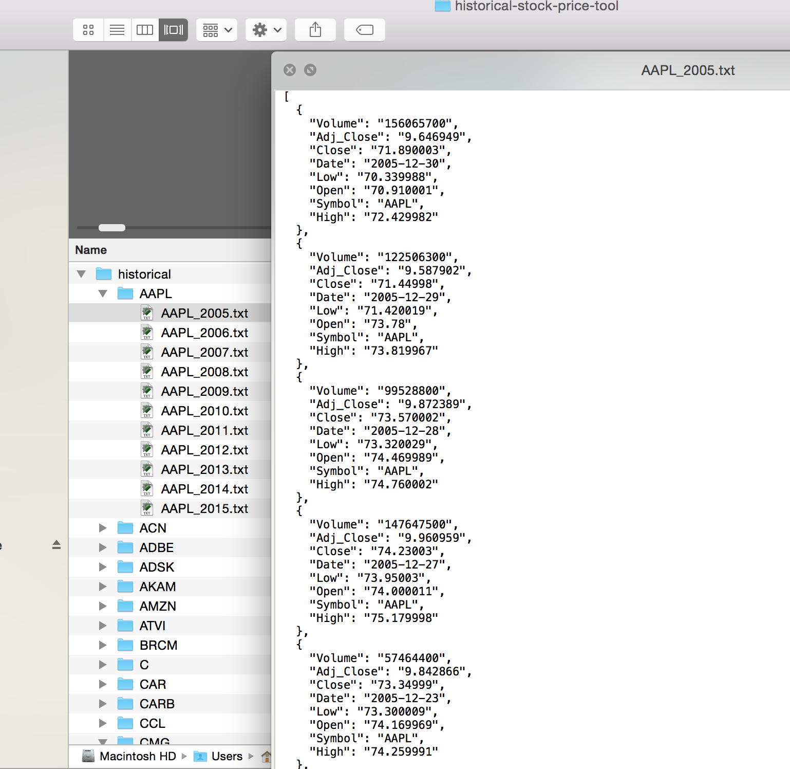

# Historical Stock Price Tool

A script to help you download many years' worth of historical data for technical analysis and candlestick charts.

- Uses https://query.yahooapis.com/ as its data source
- Currently configured to download years 2005 through 2016 for each stock
- Returns opening price, closing price, volume, backwards close adjustment, low price, and high price for each date.
<br><br>

### Example of data formats after downloading:



Example stock_list.txt JSON file (same format as jshoe/stock_portfolio_manager):

```json
[
  {
    "symbol":"AAPL",
    "symbol":"MSFT"
  }
]
```